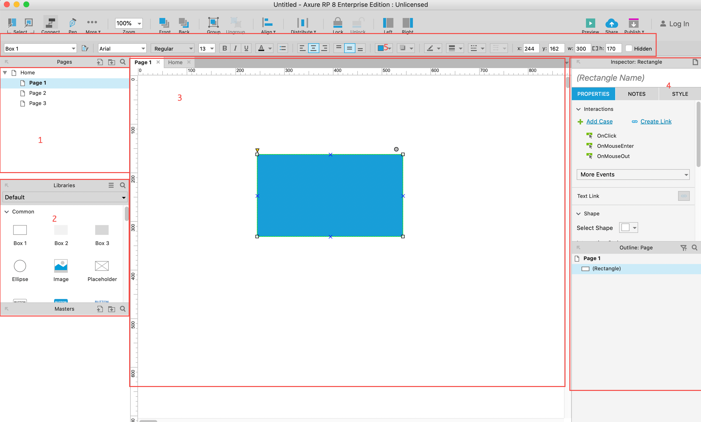
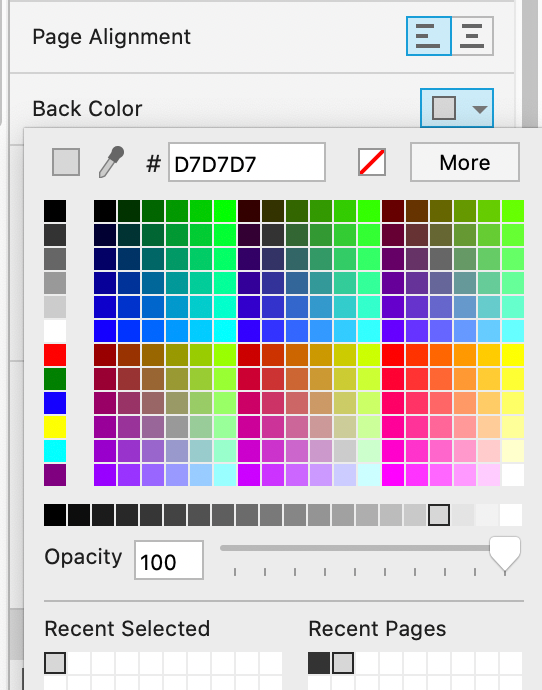

# 01-线框图

## 基础介绍

### 作用

1. 描述互联网产品设计的文档
2. 项目中，与相关部门沟通需求的工具（RD、UI）
3. 敏捷开发中，简化版的需求文档（PRD、MRD）——原型图+简要说明

### 原型图的种类

1. 线框图：制作快、成本低、设计空间大、可能表意不明
2. 高保真：耗时、还原度高、保证设计效果
3. 需求文档（PRD/MRD）：增加更多业务逻辑说明，直接指导研发

### 基础界面

1. 站点地图
2. 元件库
3. 绘图区/制作区
4. 属性区
5. 中间栏：对元件内部进行设置

{ .ac-center width=600px }

## 练习：微信朋友圈-Me

1. 绘制线框图（微信朋友圈）
   * 画布缩小（百分比）
   * 背景置灰（D070707），边界清晰

{ .ac-center width=300px }

